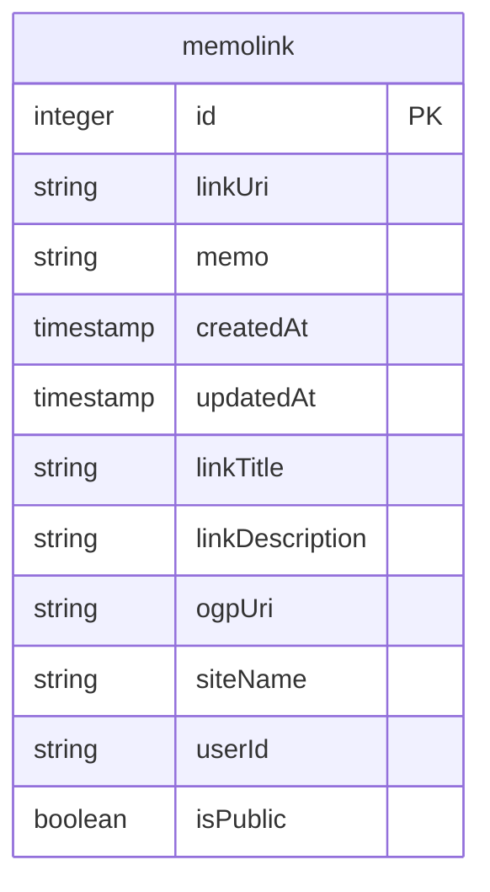

# アプリ名称

Memo Link

### 概要

「読んだ記事」「興味のある投稿」を起点に、日々の考え事、興味を記録するサービスです。

投稿は、最低限必要ものとして「記事URL」だけ。  
感想やメモも追加すると、未来の自分が振り返る時に思い出しやすくなります。

# 技術構成

このリポジトリはメインとしてTypescriptを使って構築しています。

- Backend
  - サーバーフレームワーク：Express
  - 認証サービス：fireabse
  - データベース：postgres
  - データベースコネクタ：Knex
- Frontend
  - React：フロントエンドフレームワーク
  - vite：プロジェクトビルダー
  - antd：デザインフレームワーク
  - react-router: ルーティングライブラリ
  - swr：通信管理ライブラリ

# ビルド

ここではプロダクション向けビルド方法と開発向けビルド方法を記載します。

まず共通の設定として下記が必要です。

- 環境変数の設定
  環境変数は下記の項目が必要です。  
  （現状は認証系の変数でかなり数が多岐に渡っていますが、整理する予定です）

```.env
# データベース接続用（開発環境）
DB_USER
DB_PASSWORD
DB_NAME

# データベース接続用（プロダクション環境）
DATABASE_CONNECTION

# express側　Firebase Auth 接続用
FIREBASE_AUTH_SECRET
FIREBASE_API_KEY
FIREBASE_AUTH_DOMAIN
FIREBASE_PROJECT_ID
FIREBASE_STORAGE_BUCKET
FIREBASE_MESSAGING_SENDER_ID
FIREBASE_APP_ID
FIREBASE_MEASUREMENT_ID

FIREBASE_APP_TYPE
FIREBASE_APP_PROJECT_ID
FIREBASE_APP_PRIVATE_KEY_ID
FIREBASE_APP_PRIVATE_KEY
FIREBASE_APP_CLIENT_EMAIL
FIREBASE_APP_CLIENT_ID
FIREBASE_APP_AUTH_URI
FIREBASE_APP_TOKEN_URI
FIREBASE_APP_AUTH_PROVIDER_X509_CERT_URL
FIREBASE_APP_CLIENT_X509_CERT_URL
FIREBASE_APP_UNIVERSE_DOMAIN

# vite側　Firebase Auth 接続用
VITE_FIREBASE_AUTH_SECRET
VITE_FIREBASE_API_KEY
VITE_FIREBASE_AUTH_DOMAIN
VITE_FIREBASE_PROJECT_ID
VITE_FIREBASE_STORAGE_BUCKET
VITE_FIREBASE_MESSAGING_SENDER_ID
VITE_FIREBASE_APP_ID
VITE_FIREBASE_MEASUREMENT_ID
```

- データベースの構築
  - データベース名は任意で良いですが、環境変数に設定値を入れること。

## 開発ビルド・実行

下記のコマンドを順に実行することでサーバーを起動します。

```bash
[project-root]/ $ yarn
[project-root]/ $ yarn dev
```

下記のコマンドを順に実行することでReact開発用サーバーを起動します。

> [!Warning] サーバーを起動している時は別ターミナルで起動すること。

```bash
[project-root]/ $ cd client
[project-root]/client $ yarn
[project-root]/client $ yarn dev
```

## プロダクションビルド・実行

プロジェクトルートで下記のコマンドを実行

```bash
[project-root]/ $ yarn build
```

これにより、

1. Reactのビルド
2. Reactのビルド済みファイルを`/public/`配下に移動
3. Expressの静的ホスティングでビルド済みファイルを参照可能に

### 実行

```bash
[project-root]/ $ yarn start
```

環境変数`PORT`の番号、もしくは、3000にてサーバーが起動します。

# データベース構成

接続想定：　Postgres

マイグレーションファイル：`/db/migrations`に定義

### スキーマ


